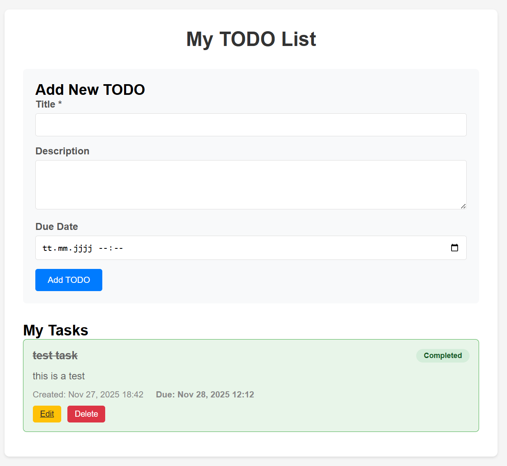

# Question 1 - How to install Django
`python -m pip install Django`
# Question 2 - Where to include the App
In `settings.py`
# Question 3 - What is the next step?
The next step is to *run migrations*:
1) `python manage.py makemigrations`
2) `python manage.py migrate`
# Question 4 - Where to put the logic?
The `views.py` file is the standard Django location for request handling logic
# Question 5 - Where do you need to register the directory with the templates?
We need to register the templates in `TEMPLATES['DIRS']` in project's `settings.py`.
# Question 6 - What command is used for running tests in the terminal?
`python manage.py test`

Run the application with `python manage.py runserver`:

